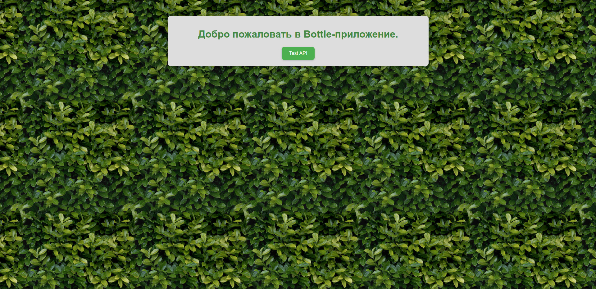

# Bottle Base — базовый шаблон для приложений на Bottle
Bottle — это простой и лёгкий Python-фреймворк для создания веб-приложений.
Он идеально подходит для небольших проектов.


## 🔧 В шаблоне реализовано:
- Базовая структура проекта
- Конфигурация через `config.py`
- Тестовый HTML-маршрут(`/`) и API(`GET  /api/ping`)
- Поддержка статики (CSS, JS, изображения, шрифты)
- Логирование:
    - Ротация логов: ежедневно
    - Хранятся: 7 дней
    - Уровни логов: от `INFO` до `CRITICAL`

## 📦 Структура проекта
```
├── app/
│   ├── controllers/
│   │   ├── api.py
│   │   ├── html.py
│   │   └── static.py
│   │   
│   ├── models/
│   ├── services/
│   ├── views/
│   └── log.py
│
├── logs/
├── media/
├── static/
├── config.py
├── run.py
└── README.md
```

## ⚙️ Установка и запуск
```bash
git clone https://gitverse.ru/Rockdukan/bottle-base.git
cd bottle-base
uv venv
uv sync  # ставит зависимости из pyproject.toml
uv run run.py
```

Если вы предпочитаете устанавливать зависимости из `requirements.txt`, можно сделать так:
```bash
python -m venv .venv
source .venv/bin/activate
pip install -r requirements.txt
python run.py
```

## 🧪 Тестирование
```bash
uv sync --extra dev
uv run pytest -q
```

## 🌐 Маршруты

- `GET /`  
  Отдаёт HTML-страницу из шаблона `index.tpl` с кнопкой проверки API и формой с защищённым POST-запросом.

- `GET /api/ping`  
  Простой health-check эндпоинт. Возвращает JSON:

  ```json
  {"status": "ok"}
  ```

- `POST /api/protected`  
  Пример защищённого CSRF эндпоинта. При корректном токене возвращает:

  ```json
  {"status": "protected-ok"}
  ```

  Если токен отсутствует или некорректен, вернётся `403 Forbidden`.

## 🛡 CSRF-защита

В шаблоне реализована простая CSRF-защита на основе cookie:

- при открытии `/` backend:
  - генерирует случайный CSRF-токен (если его ещё нет),
  - сохраняет его в cookie (только для HTTP, с ограничениями по времени жизни),
  - передаёт токен в шаблон как переменную.
- в HTML-форме токен пробрасывается в скрытое поле:

  ```html
  <input type="hidden" name="csrf_token" value="{{csrf_token}}">
  ```

- при запросе `POST /api/protected`:
  - backend читает токен из формы и из cookie,
  - сравнивает значения и возвращает `403`, если они не совпадают.

Этот подход можно переиспользовать для любых POST-форм в вашем приложении.
